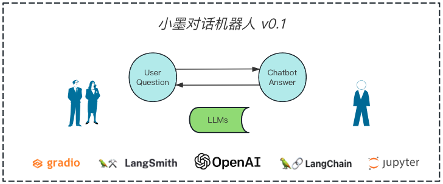

## Version 0.1 

### Description
```
只是为了演示如何进行对话
利用大语言模型的只有知识来回答
会存在幻觉的现象
需要做好角色定义和回答约束
避免涉及到敏感的知识
```

### Architecture



### Environment
```shell
# 如果是 Azure OpenAI (选项)
os.environ["OPENAI_API_TYPE"] = "azure"
os.environ["OPENAI_API_BASE"] = "https://<your-endpoint.openai.azure.com/"
os.environ["OPENAI_API_VERSION"] = "2023-03-15-preview"

export OPENAI_API_KEY="<your-api-key>"

export LANGCHAIN_TRACING_V2=true
export LANGCHAIN_ENDPOINT="https://api.smith.langchain.com"
export LANGCHAIN_API_KEY="<your-api-key>"
export LANGCHAIN_PROJECT="mobot"
```

### License
``` 
版权声明
本仓库代码版权归墨问西东和作者本人所有，除墨问西东 AI 大模型项目实战集训班学员外，其它用户未经授权禁止商业使用。
```