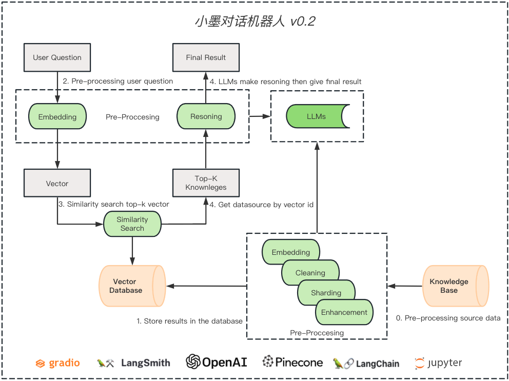

## Version 0.2 

### Description
```
为了解决/减少大语言模型的幻觉现象
引入新的技术手段
首先是要根据用户问题去检索知识库
接着在这些知识里用大模型推理出正确的答案
这样小墨就可以回答出正确的事实
```

### Architecture



### Environment
```shell
# 如果是 Azure OpenAI (选项)
os.environ["OPENAI_API_TYPE"] = "azure"
os.environ["OPENAI_API_BASE"] = "https://<your-endpoint.openai.azure.com/"
os.environ["OPENAI_API_VERSION"] = "2023-03-15-preview"

export OPENAI_API_KEY="<your-api-key>"

export LANGCHAIN_TRACING_V2=true
export LANGCHAIN_ENDPOINT="https://api.smith.langchain.com"
export LANGCHAIN_API_KEY="<your-api-key>"
export LANGCHAIN_PROJECT="mobot"
```

### License
``` 
版权声明
本仓库代码版权归墨问西东和作者本人所有，除墨问西东 AI 大模型项目实战集训班学员外，其它用户未经授权禁止商业使用。
```