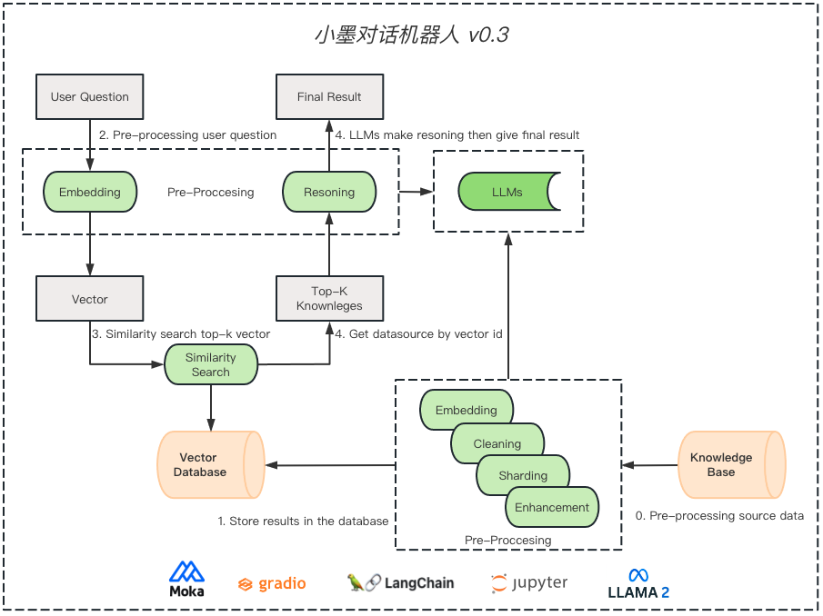

## Version 0.3 

### Description
```
使用三驾马车来驱动私有化的部署

1. 私有化文本嵌入模型（moka embedding）
2. 私有化大语言模型（llama2 & qwen）
3. 私有化向量数据库（milvus）

插件化设计，可随意替换掉任何的部件进行重组。
oepnai embedding + llama2 + pinecone 
moka embedding + openai gpt + milvus 
...
```

### Architecture



### Environment
请参考配置文件 config.yaml


### License
``` 
版权声明
本仓库代码版权归墨问西东和作者本人所有，除墨问西东 AI 大模型项目实战集训班学员外，其它用户未经授权禁止商业使用。
```