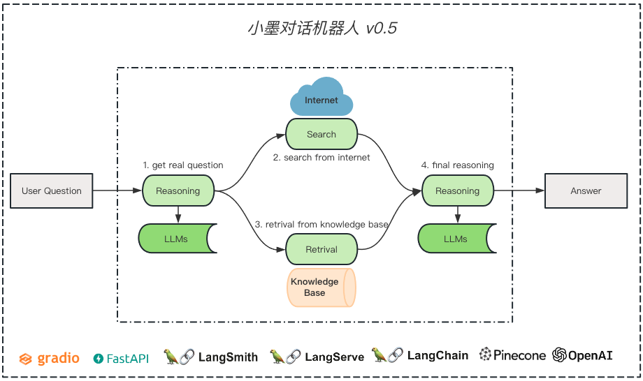

## Version 0.5

### Description
```
增强 DAG 架构
解决无效话语的任务干扰
解决时效性问题的对话

部署架构
容器镜像的打包
容器平台的发布
```

### Architecture



### Environment
```python
# 在 util.py 文件添加以下配置激活 LangSmith 的工作
os.environ["LANGCHAIN_TRACING_V2"] = "true"
os.environ["LANGCHAIN_ENDPOINT"] = "https://api.smith.langchain.com"
os.environ["LANGCHAIN_API_KEY"] =  "replace to your langsmith api key"
os.environ["LANGCHAIN_PROJECT"] = "replace to your project name"

# 魔法同理
os.environ["http_proxy"] = 'http://127.0.0.1:7890'
os.environ["https_proxy"] = 'http://127.0.0.1:7890'
```

```shell
# 配置解释
config:
  openai:
    api_key: "replace to your openai api key" # 参考 OpenAI API Keys 页面
    chat_model: "gpt-3.5-turbo-16k-0613"
    embedding_model: "text-embedding-ada-002"

  pinecone:
    api_key: "replace to your pinecone api key" # 参考 Pinecone API Keys 页面
    environment: "asia-southeast1-gcp-free"
    index: "mobot"

  tavily:
    api_key: "replace to your tavily api key" # 参考 Tavily API Keys 页面

  self:
    api_key: "123456" # 这个 Key 是用于其他 HTTP 请求 API 时的鉴权
```

### License
``` 
版权声明
本仓库代码版权归墨问西东和作者本人所有，除墨问西东 AI 大模型项目实战集训班学员外，其它用户未经授权禁止商业使用。
```